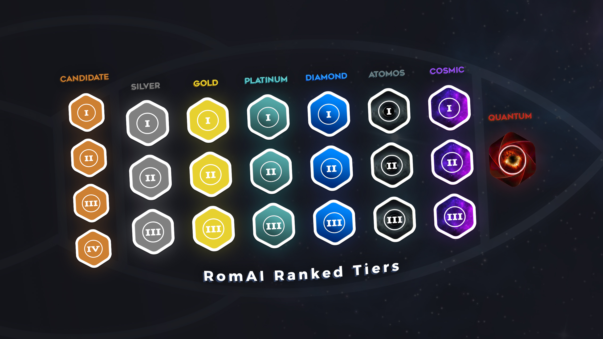
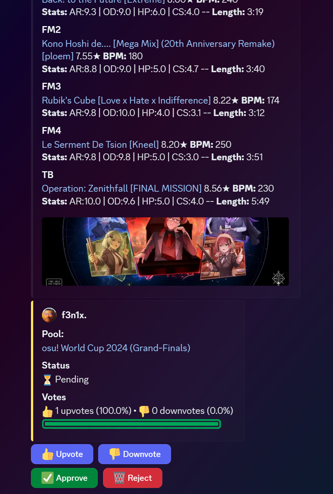
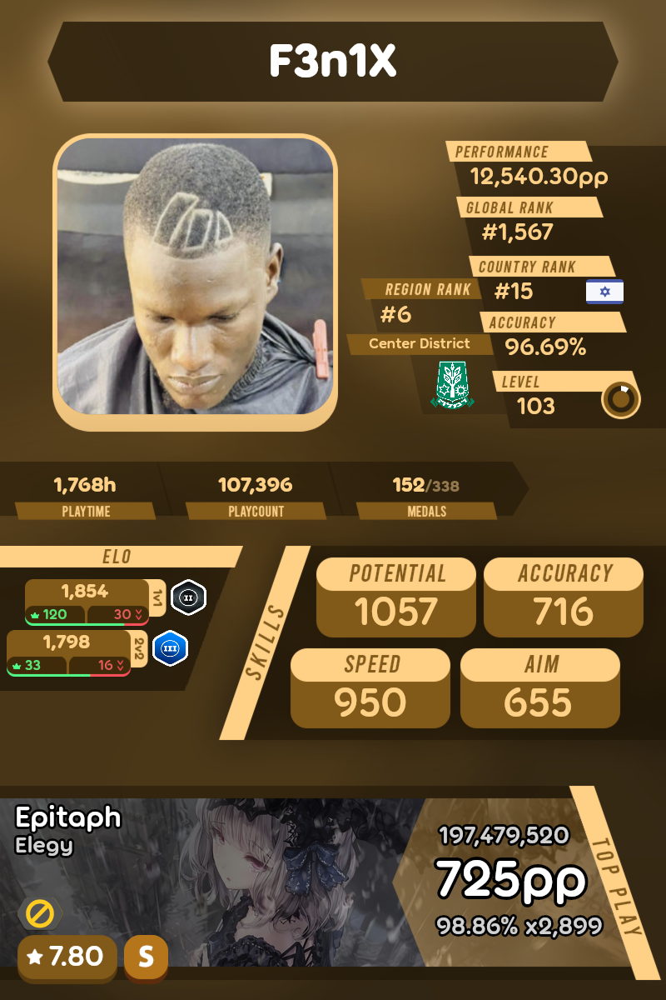

#  RomAI   

RomAI is a feature-rich **osu! / Discord bot** that combines classic stat tracking with competitive ranked modes, card collecting, leveling systems, and matchmaking — all powered by a skill-based ELO system.

---

## ✨ Features

**USE `/help` IN DISCORD FOR ALL THE DIFFERENT COMMANDS**

### 🎮 Classic osu! Commands
- `!r` – Display your **most recent osu! play** and get packs for getting top plays!
- `!c` – **Compare** your plays to another recent or compare command
- `!user` – View detailed **user stats**, including:
  - Global/Country/Region ranks
  - RomAI **ELO rating**
  - 1v1 & 2v2 **ranked stats**
  - **RomAI Level** and XP
- **Beatmap auto-detection** in chat

---

### 🏆 Ranked Mode & Auto Matches
- `/matchmaking` – Queue for **1v1 or 2v2 ranked** matches
  - Bo7 or Bo9 on ELO (1700+)
  - Map pool chosen from 6 ELO-balanced pools
- `/duel` – Challenge someone to a **custom 1v1 ranked match**
- `/duos` – Create a **2v2 custom ranked match** with friends
- `/trios` – Create a **3v3 custom match** *(custom pool only)*
- `/serverleaderboard` - View the leaderboards of the current server (or `/globalleaderboard` for global leaderboards)

#### 🥇 Ranked Tiers
Ranks from lowest to highest:
```
Candidate I–IV → Silver I–III → Gold I–III → Platinum I–III → Diamond I–III → Atomos I–III → Cosmic I–III → Quantum
```



---

### 📚 Map Pools

Manage and explore curated map pools used in ranked play:

- `/mappools list` – View a list of all available map pools
- `/mappools show <name>` – Display the maps within a specific pool
- `/mappool-suggest` – Suggest a new map pool for potential ranked use



---

## 🃏 Card Collecting & Leveling
- `/playercard` - Display the custom player card of a user
- `/inventory` – View your **packs**, **cards**, and **romBucks**
- `/packshop view` - View the available packs in the shop
- `/packshop buy` - Use your romBucks to buy packs
- `/tradeoffer` - Trade cards or packs with a desired user
- `/quicksell` - Sell a card from your inventory by it's rarity's worth
- `/packuse` – Open card packs featuring real **osu! players**
- `/dailychallenges` – Complete rotating **daily challenges** (rerollable)
- Cards come in rarities:
  - **Base**, **Refined**, **Remarkable**, **Glorious**, **Legendary**, **Timeless**



#### 📈 Level System
- Start at Level 0, 0/50 XP
- Max XP increases by 50 per level

---

## 🧠 Formulas Used in RomAI

### 🧮 Card Stats

$\text{Aim} = ((a + \text{hidden}) \cdot \left(\frac{cs^{0.1}}{4^{0.1}} \cdot \left(2 - \frac{\text{misses}}{5}\right)\right)^{\text{scoreSr}^{0.1}}) \cdot 100$

$\text{Speed} = \left(s \cdot \left(\frac{100 \cdot \text{scoreBpm}}{220} \cdot \frac{c^{0.1}}{200 \cdot \left(\frac{9.5}{ar}\right)}\right)\right) \cdot 2 \cdot 100$

$\text{Accuracy} = \left(\frac{acc}{100}\right)^{20} \cdot \left(\frac{\text{aimCalc}}{2}\right) \cdot \left(0.083 \cdot sr \cdot 1.42^{(c/mc)} - 0.3\right) + \left(\frac{\text{speedCalc}}{2}\right) \cdot \left(\frac{od}{9}\right) \cdot \left(\frac{hd}{6}\right) \cdot \left(\frac{mc^{0.12^{(c/mc)}}}{2}\right)$

$\text{Potential} = \text{fixedPP scores} + \text{fixedAccuracyCalc}$

### ⚖️ ELO Rating

$\text{ELO}_{\text{new}} = \text{ELO} + \frac{32}{2} \cdot \left(\text{win} + 0.5 \cdot \left(\frac{\text{diff}}{c}\right)\right)$

*win = 1 || -1*

### 🎯 Map Pool ELO

$\text{PoolELO} = \left(\text{avgStars} \cdot 0.7 + \text{nm1Stars} \cdot 0.3\right) \cdot 250$

---

## 🛠️ Tech Stack

- [Node.js](https://nodejs.org/)
- [discord.js](https://discord.js.org/)
- [osu.js](https://github.com/L-Mario564/osu.js)
- [@kionell/osu-pp-calculator](https://www.npmjs.com/package/@kionell/osu-pp-calculator)
- [MongoDB](https://www.mongodb.com/)
- [osu!world](https://osuworld.octo.moe/)

---

## 👥 Credits & Acknowledgments

- **DarkerSniper** aka *Rom* – Main developer and project maintainer
- **Soii** – Created the trading cards and their frontend design + helps with development
- **Sk8terB0i87** – Designed the ranked tier logos & Timeless rarity
- **MintLeaf** – Designer of the **RomAI logo**

---

## 💬 Join the Community

[](https://discord.gg/QgdqscCsJk)

---

## 💖 Donate & Support

If you enjoy RomAI and want to help support development:

[](https://ko-fi.com/romdarker)

---

## 🔒 License & Usage

RomAI is a passion project built with a lot of time and effort from the team.
Please **do not copy or redistribute any part of this project without permission**.
If you're interested in contributing or learning from the project, feel free to reach out!

---
